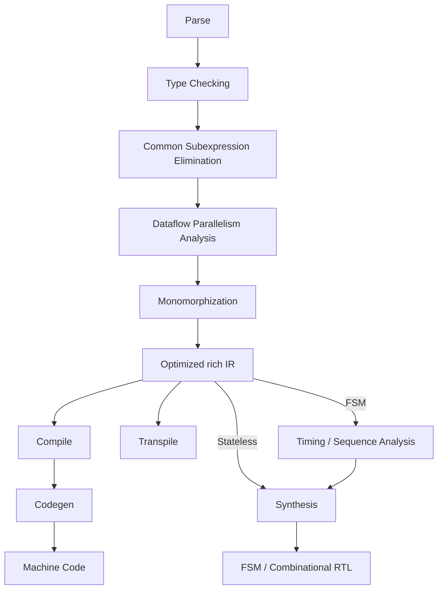

# Paracell

**This is a research project.**

A compiler and synthesizer with

- Dataflow parallelism analysis
- Features from FP to be dataflow-friendly
- High-level synthesis

## Overview



## Syntax

```rust
// Pure combinational logic.
// Time: 0 step.
fn ALU(operands: Array<Nat, 2>, op: Op) -> Nat {
    let a = operands[0];
    let b = operands[1];

    match op {
        Op::Add => a + b,
        Op::Sub => a - b,
        Op::Mul => a * b,
    }
}

struct Packet {
    id: Nat<8>
}

// Sequential logic.
// Time: `$quotient` steps. [UNDECIDABLE]
// Result: (isInvalid, quotient, remainder)
fn Divide(dividend: Nat, divisor: Nat) -> (Nat<1>, Nat, Nat) {
    match divisor {
        0 => (1, 0, 0), // Invalid divisor.
        _ => {
            let mut remainder = dividend;
            let mut quotient = 0;

            // FSM must be guaranteed to halt.
            // Overflow analysis is required.
            while divisor < remainder {
                // Adding or subtracting zero is not allowed when the loop condition depends on it.
                // Explicitly branch the situation.
                remainder = remainder - divisor;
                quotient = quotient + 1;
            }

            (0, quotient, remainder)
        }
    }
}
```

# Parsing

## Semantic layer for different parsers

This package aims to provide a unified AST structure for all types of parsers and kinds of syntax.

### *.lalrpop

I think the syntax that from LALRPOP is generic for LL, LALR and PEG.
So I'm keeping the LALRPOP descriptions here.

I'm considering build a PEG parser generator which continuously use the LALRPOP syntax as the language form description
language.
